# Travel Blog

Welcome to my Travel Blog! This blog allows me to share my travel experiences with my friends. My friends can view and interact with my posts by leaving comments.

Please note that to access the full functionality of the blog, users need to sign up and log in. The blog uses tokens to authenticate and authorize valid users. Once logged in, users can navigate to the home page by clicking on their profile in the header. They can also click on each post to view its dedicated page, where they can leave comments, edit their own comments, delete them, and reply to other users' comments.

## Project Structure

The project is divided into two parts: the backend and the UI.

## Backend

The backend of the project is implemented using the MVC pattern, Node.js, Express.js, and TypeScript. The data is stored in a MongoDB database using Mongoose. The backend provides a set of RESTful APIs to interact with the data.

To get started with the backend:

1. Navigate to the backend directory:
cd back-end/

2. Install the dependencies:
npm install

3. Start the server:
npm start

The backend will be up and running on the specified port(8080), providing the necessary APIs for the frontend to interact with the database.

## Frontend

The frontend of the project is implemented using React.js, TypeScript, and Material-UI. It utilizes Redux Saga for handling asynchronous actions and managing application state. Styled Components is used for styling the components, providing a flexible and maintainable approach to styling in React applications. Axios is used for making HTTP requests to the backend APIs.

To get started with the frontend:

1. Navigate to the ui directory:
cd ui/

2. Install the dependencies:
npm install

3. Start the development server:
npm start

4. Access the Travel Blog in your web browser:
Open your preferred web browser.
Visit http://localhost:3000 to see the blog.

Feel free to explore the blog, sign up, and start your travel adventures! Or login by my own username (nazanintarafi@yahoo.com) and password (pass1234). 

If you have any questions or feedback, please don't hesitate to reach out.

Enjoy your time on the Travel Blog! 🌍✈️

---

## Screenshots

Here are some screenshots to give you an overview of the project:

### Login Page and Error Notifications
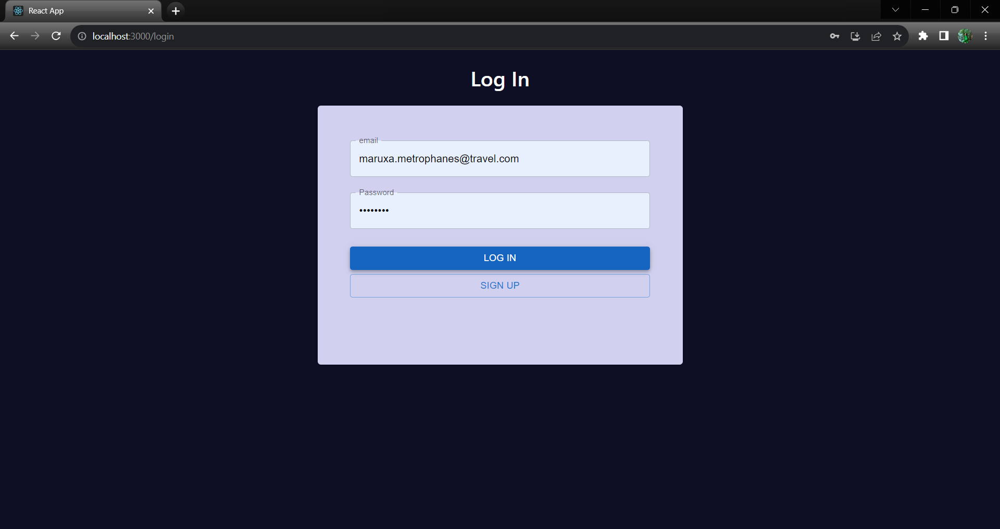
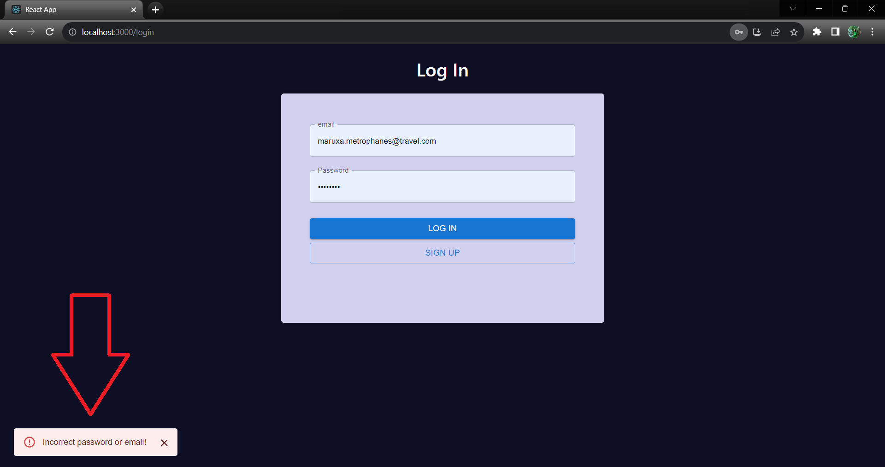

### Sign Up Page and Alerts
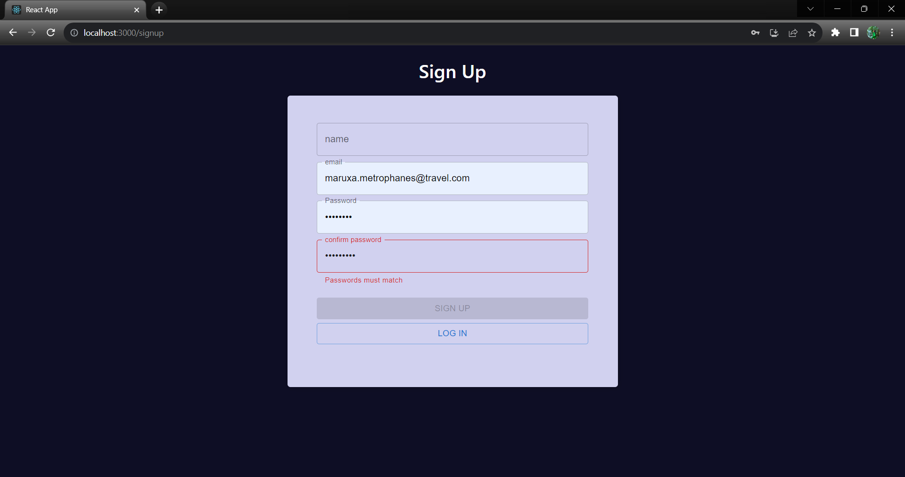
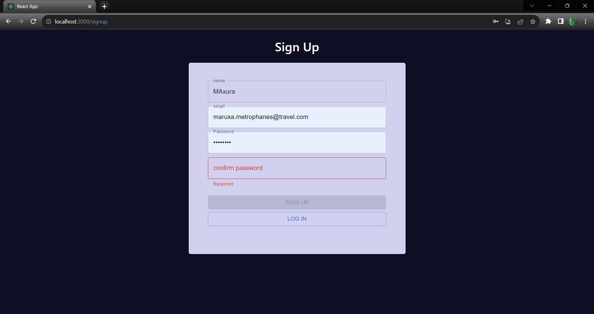
Users are redirected to the login page and receive a notification if they attempt to create a duplicate account.
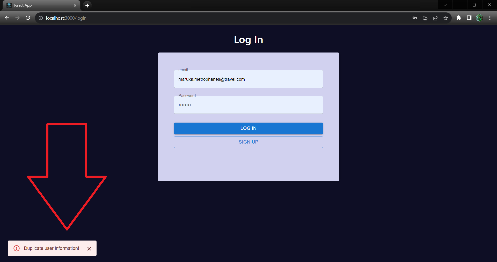

### Home Page
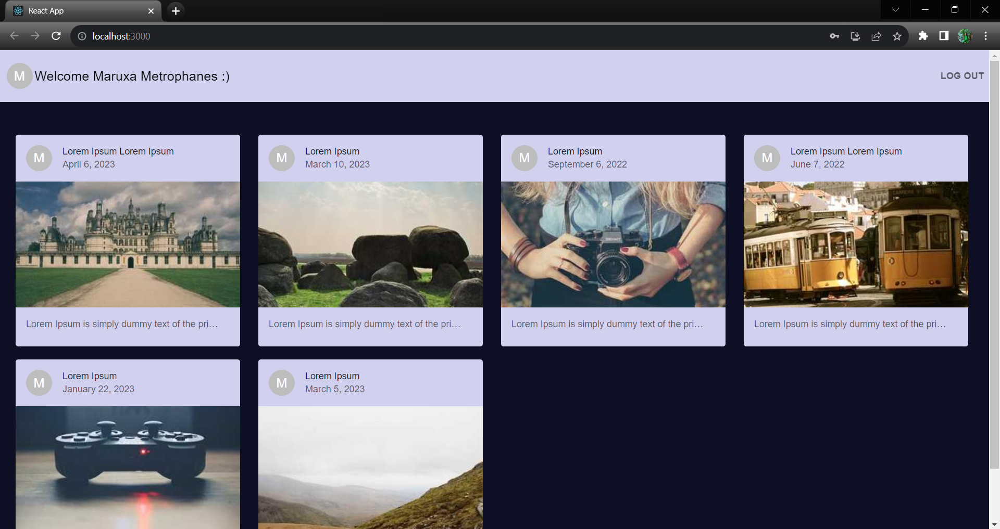
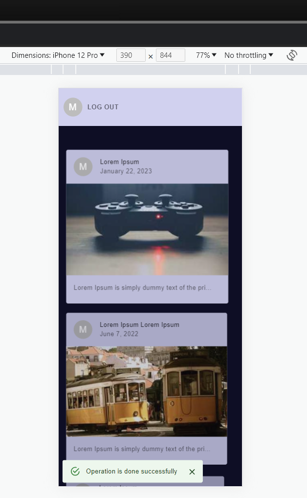
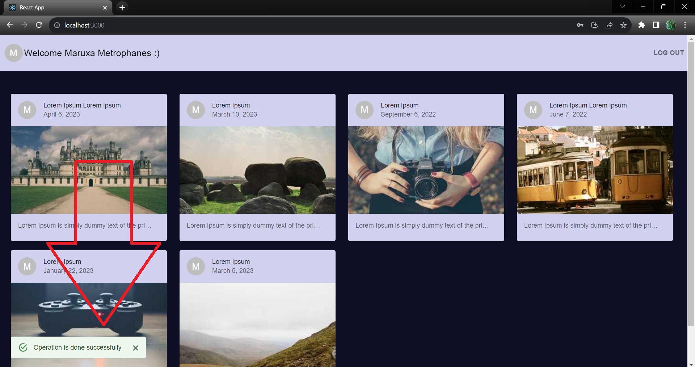

### Post Individual Page and Comment Section
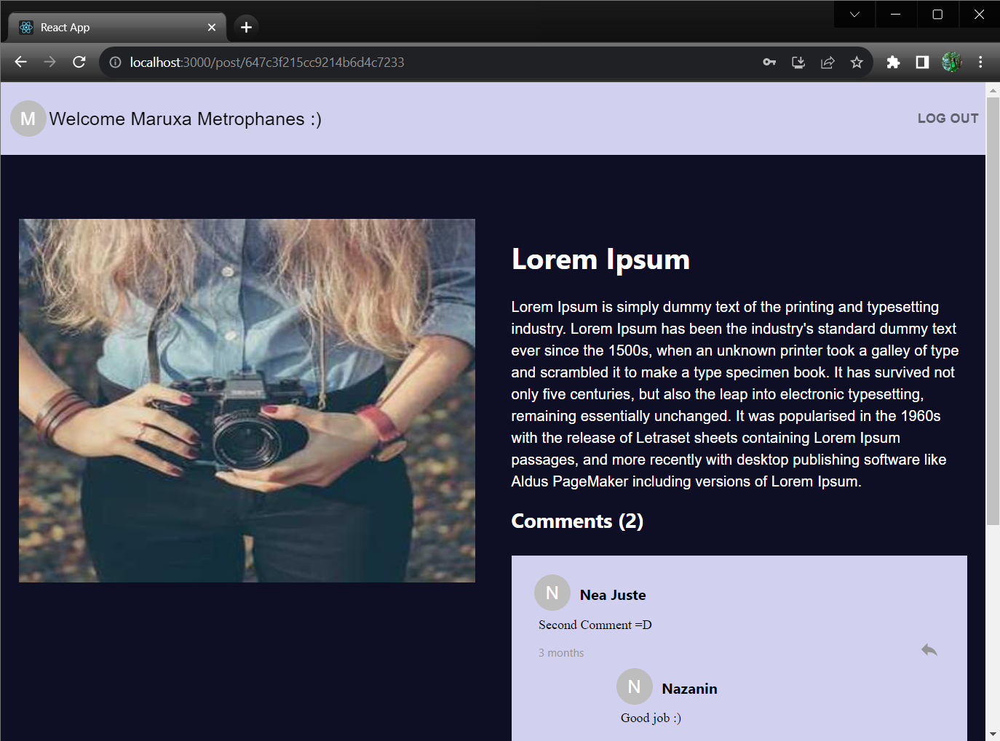
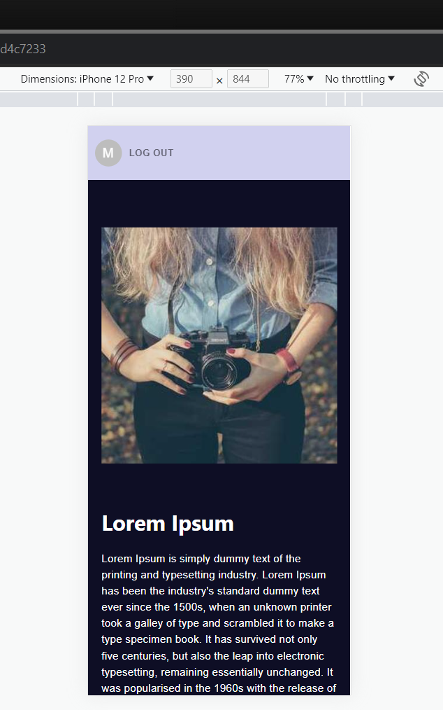

### Comment Section
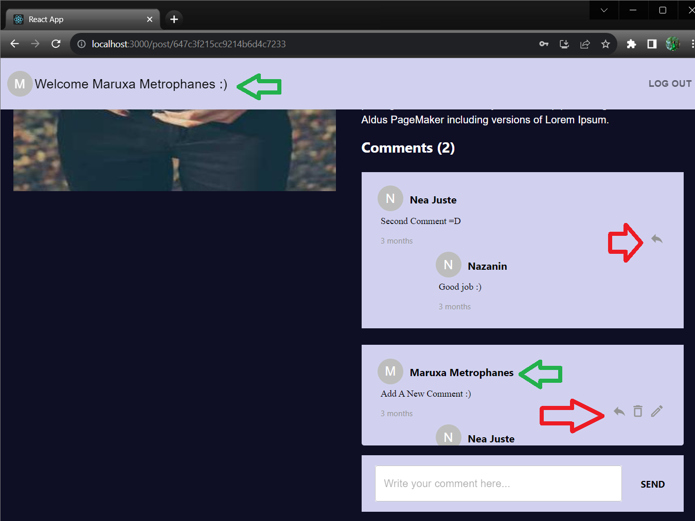
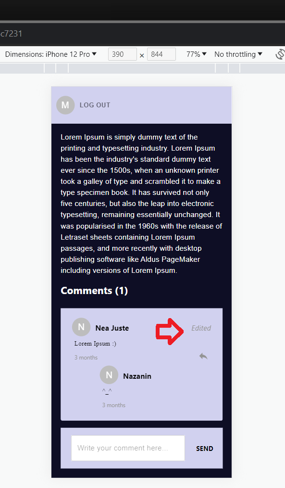
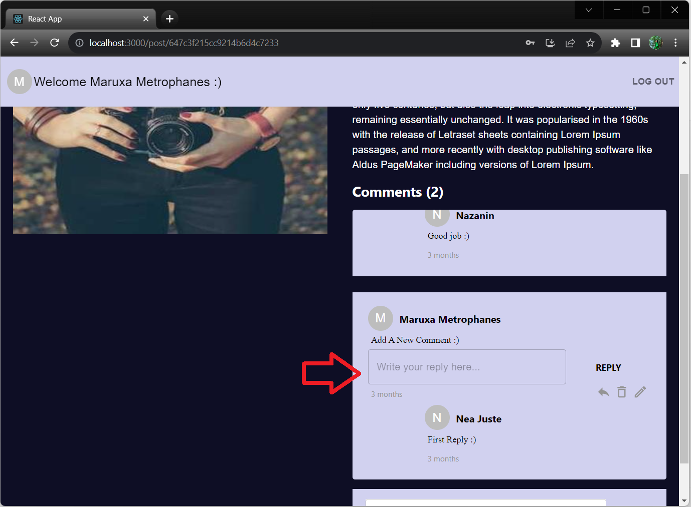
